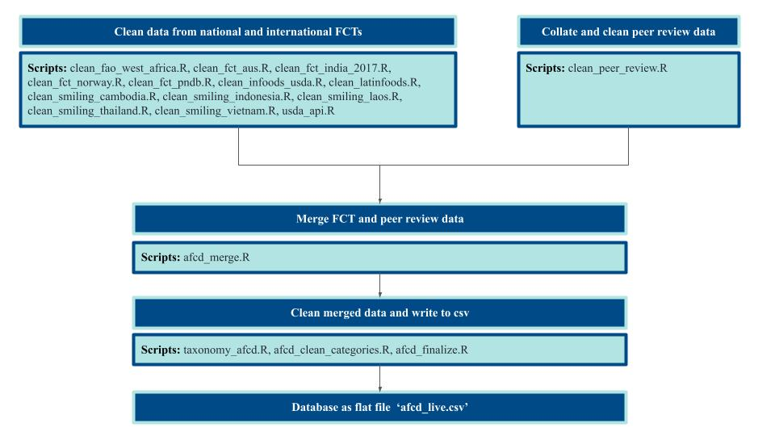

# **Aquatic Food Composition Database**

Welcome to the Aquatic Food Composition Database! 

This repository synthesizes existing nutrient composition data for aquatic food species. These data originate from disparate sources, including national food composition tables (FCT), international datasets from FAO, and other peer reviewed published sources of nutrient composition. New FCT are dynamically added to this comprehensive database. Authorship for this database includes Christopher D. Golden, J. Zachary Koehn, Bapu Vaitla, Camille DeSisto, Kathryn J. Fiorella, Marian Kjellevold and Shakuntala H. Thilsted. 

Scripts included in this repository have different functional roles, including: extracting data from the raw FCT data, cleaning of FCT data, merging of FCT data and results of the literature review, adding taxonomic information, and finally cleaning/finalizing the overall database. References for this literature can be found [will add link here]()

The resulting database can be found at:
 Golden, C.D., Koehn, J.Z., Vaitla, B., DeSisto, C., Kelahan, H., Manning, K., Fiorella, K.J., Kjellevold, M., Thilsted, S.H., 2021b. Aquatic Food Composition Database. Harvard Dataverse, V2. [https://doi.org/https://doi.org/10.7910/DVN/KI0NYM.](https://doi.org/10.7910/DVN/KI0NYM).

### Flowchart of scripts used to create AFCD

## Extracting and cleaning FCT data

These scripts extracted and/or cleaned the FCT data from national and international databases as needed. Databases included here include all FCT databases that were available online in machine-readable formats (e.g., .csv). We intend to continue to build on this set as more databases become available. Note that a number of FCTs (data from Bangladesh, Canada, Mozambique, Japan, Argentina, Gambia, United Kingdom, Chile, Malaysia, Italy and Turkey) were already compiled as part of a previous project. As such, the scripts and descriptions included in the table below pertain only to the tables added as part of this project. 

 
 - **clean_fao_west_africa.R** - Cleans FAO's West Africa Food Composition Table dataset 
 - **clean_fct_aus**  Script cleans Australia's 2019 food composition database and subsets for aquatic foods, appended to AFCD in another script.
 - **clean_fct_india_2017**  Extracts nutrition tables from the PDF of India's 2017 FCTs, and cleans them for appending to AFCD. 
 - **clean_fct_norway.R** - Cleans data from the Norwegian Food Composition Database 
 - **clean_fct_pndb.R** - Cleans data from the Pacific Nutrient Database by Pacific Community, University of Wollongong and the Food and Agriculture Organization of the United Nations 
 - **clean_infoods_usda.R** - Cleans and adds FAO/INFOODS Global Food Composition Database for Fish and Shellfish and FAO/INFOODS Food Composition Database for Biodiversity  
 - **clean_latinfoods.R** - Cleans data from the international LATINFOODS dataset 
 - **clean_smiling_cambodia.R** - Cleans Cambodia data from the EU-SMILING project 
 - **clean_smiling_indonesia.R** - Cleans Indonesia data from the EU-SMILING project 
 - **clean_smiling_laos.R** - Cleans Laos data from the EU-SMILING project 
 - **clean_smiling_thailand.R** - Cleans Thailand data from the EU-SMILING project 
 - **clean_smiling_vietnam.R** - Cleans Vietnam data from the EU-SMILING project 
 - **usda_api.R** - Uses an API to query online USDA database (no data required), and cleans that USDA data for merge with existing AFCD dataset. 

## Peer review data extraction and cleaning
**clean_peer_review.R**, brings together a number of different spreadsheets that include, and joins them by the metadata associated with each study. Where relative values of nutrients were reported, the script calculates the absolute value (e.g., the  value of a fatty acid relative to total fat content in the sample)

## AFCD synthesis and cleaning
Describes scripts that are used to merge FCT and peer review data. This section can also include an overview of parts/processing. Scripts are run in order from 1 to 4, with *afcd_finalize.R* outputing the final csv file. 

1. **afcd_merge.R** - Merges together cleaned national and international FCT data (output from each script below) as well as the cleaned peer review data (from *clean_peer_review.R*).
2. **taxonomy_afcd.R** - Adds taxononomic information to each of the products in AFCD.
3. **afcd_clean_categories.R** - Includes the codes and categories used to clean the parts and preparation columns in *afcd_finalize.R*
4. **afcd_finalize.R** - This script cleans the merged AFCD data with taxonomic information. 
